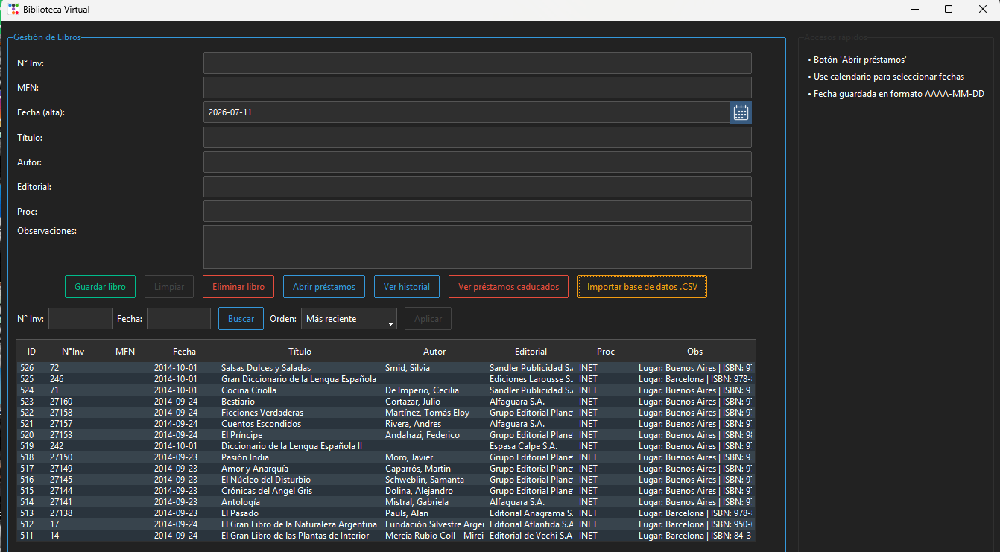
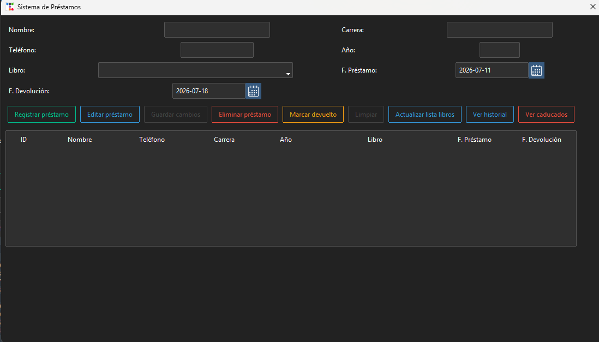

# biblioteca-virtual
📚 Biblioteca Virtual

Aplicación de escritorio desarrollada en Python como parte de las Prácticas Profesionalizantes de la Tecnicatura Superior en Análisis de Sistemas.

El sistema fue creado para una biblioteca que gestionaba el catálogo y los préstamos de forma manual, registrando la información en papel. El objetivo fue digitalizar este proceso mediante una aplicación que facilitara la administración de libros, préstamos e historial de movimientos.

📋 Descripción

El sistema fue diseñado para digitalizar la administración de una biblioteca, permitiendo registrar libros, gestionar préstamos, consultar historial y mantener un control organizado de la información.
Durante las Prácticas Profesionalizantes, desarrollamos este sistema para modernizar la gestión de una biblioteca que no contaba con un software de administración.

Antes de la implementación, los préstamos y devoluciones se registraban manualmente en cuadernos, lo que dificultaba el seguimiento del material y la consulta del historial. La aplicación permite centralizar toda esa información en una base de datos local, agilizando las tareas diarias y reduciendo errores en el registro.

✨ Funcionalidades

✔ Registro de libros en la base de datos
✔ Eliminación de registros
✔ Búsqueda de libros por filtros
✔ Ordenamiento de registros (ej: más recientes)
✔ Gestión de préstamos
✔ Visualización de historial de movimientos
✔ Control de préstamos vencidos
✔ Importación y exportación de datos mediante archivo CSV
✔ Interfaz gráfica intuitiva desarrollada en Tkinter

🖥️ Capturas del sistema



🛠️ Tecnologías utilizadas
Python
ttkbootstrap (interfaz gráfica, sobre Tkinter)
SQLite (base de datos local)

🗂️ Estructura del proyecto

El sistema está organizado en módulos que separan la lógica de interfaz y base de datos:

Biblioteca/
├── main.py              # Punto de entrada
├── db.py                 # Conexión y creación de tablas
├── logica_libros.py       # Lógica de acceso a datos - libros
├── logica_prestamos.py    # Lógica de acceso a datos - préstamos
├── ui_libros.py           # Interfaz - ventana principal
└── ui_prestamos.py        # Interfaz - ventana de préstamos

🚀 Cómo ejecutar el proyecto

```bash
git clone https://github.com/HidalgoDante/biblioteca-virtual.git
cd biblioteca-virtual
python -m venv venv
venv\Scripts\activate      # Windows
pip install -r requirements.txt
python main.py
```

🧠 Objetivo del proyecto

El objetivo fue aplicar conceptos de desarrollo de software de escritorio, manejo de bases de datos relacionales y diseño de interfaces gráficas utilizando Python.

🔧 Decisiones de diseño
- Separación en capas (interfaz / lógica de datos / conexión) para facilitar el mantenimiento y testing.
- SQLite por simplicidad, al ser una app de escritorio de un solo usuario.

📈 Posibles mejoras
- Migrar a una base de datos con soporte multiusuario (PostgreSQL/MySQL).
- Agregar tests automatizados.

👨‍💻 Autores

Proyecto desarrollado como parte de las Prácticas Profesionalizantes de la Tecnicatura Superior en Análisis de Sistemas.

- **Dante Sebastián Hidalgo** — desarrollo del sistema de préstamos, importación y exportación de datos vía CSV, rediseño de la interfaz gráfica, y refactorización completa del proyecto a una arquitectura modular (separación en capas de datos, lógica de negocio e interfaz — ver sección "Estructura del proyecto").

- **Fernando Buiani** — diseño visual inicial de la aplicación.

Como parte de las Prácticas Profesionalizantes de la Tecnicatura Superior en Análisis de Sistemas.
En búsqueda de mi primera experiencia profesional en el área IT.

📫 Contacto
LinkedIn: www.linkedin.com/in/dante-sebastian-hidalgo-635670237
Email: hidalgodante05@gmail.com
